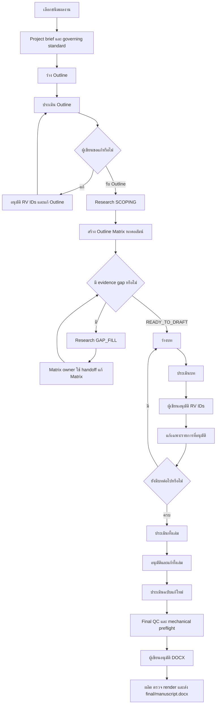
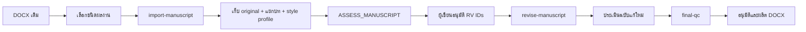
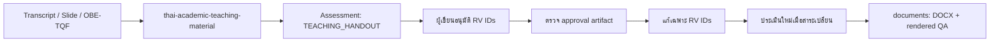

# Workflow และ Prompt สำหรับชุด Thai Academic Writing Skills

เอกสารนี้เป็นคู่มือ copy-ready สำหรับใช้ชุดสกิลตั้งแต่ตั้งโครงการจนส่งออก
DOCX โดยแยกเจ้าของงาน หลักฐาน เงื่อนไขส่งต่อ และการอนุมัติอย่างชัดเจน

> แทนค่าที่อยู่ใน `<...>` ด้วยข้อมูลจริง และใช้ absolute path ในทุก prompt
> ที่ส่งไฟล์ข้ามสกิล สถานะจาก validator ไม่ใช่การอนุมัติของผู้เขียน

## 1. สกิลและขอบเขตความรับผิดชอบ

| สกิล | รับผิดชอบ | ไม่ทำ |
| --- | --- | --- |
| `$orchestrate-thai-academic-writing` | ตรวจสถานะโครงการ เลือกขั้นถัดไป และตรวจ handoff | ไม่เขียนหรือประเมินเนื้อหาแทนสกิลเจ้าของงาน |
| `$write-thai-academic-book` | ตั้งโครงการ ร่าง/แก้ outline และบท จัด approval gate และผลิต DOCX | ไม่ค้นหลักฐานหรือประเมินเกณฑ์วิชาการซ้ำ |
| `$research-outline-evidence` | ค้นหลักฐานแบบ local-first ทำ SCOPING/GAP_FILL และ Matrix handoff | ไม่แก้ Matrix และไม่ร่างบท |
| `$build-outline-matrix` | สร้าง/แก้ Matrix หกคอลัมน์และตัดสิน `READY_TO_DRAFT` | ไม่แต่ง citation และไม่เขียนบทเต็ม |
| `$assess-thai-academic-manuscript` | ประเมิน outline รายบท ทั้งเล่ม และ route readiness | ไม่แก้ต้นฉบับและไม่อนุมัติแทนผู้เขียน |
| `$thai-academic-teaching-material` | สร้าง/แก้เอกสารประกอบการสอนจาก transcript/slide/course sources | ใช้เฉพาะสาย `TEACHING_HANDOUT` |
| `documents` | ผลิตและตรวจ DOCX ของสายเอกสารประกอบการสอน | ไม่ประเมินคุณภาพทางวิชาการ |

## 2. Flow หลักสำหรับหนังสือ ตำรา และเอกสารคำสอน



เงื่อนไขสำคัญ:

- `SCOPING/READY_FOR_MATRIX` ต้องเกิดก่อนสร้าง Matrix ครั้งแรก
- มีเพียง `$build-outline-matrix` ที่แก้ Matrix ได้
- ห้ามร่างบทก่อน Matrix เป็น `READY_TO_DRAFT`
- Matrix ต้องมีหกคอลัมน์ ไม่มี `[ต้องค้นหลักฐาน: ...]` และอ้าง Evidence Package ปัจจุบัน
- Assessment Package ต้องมี path และ SHA-256 ตรงกับ input ปัจจุบัน
- ผู้เขียนต้องอนุมัติ `RV-xxx` หรือ `CR-xxx` แบบระบุ ID ก่อนแก้
- เมื่อ Claim, Matrix, ต้นฉบับ หรือกฎเปลี่ยน ต้องตรวจ fingerprint/hash และประเมินใหม่
- DOCX สุดท้ายต้องผ่าน `MEETS_TARGET`, `Status: APPROVED` และ `Deliverable: DOCX`

## 3. Prompt ทีละขั้นตอน: โครงการใหม่

### ขั้นที่ 1 — เลือกชนิดผลงาน

เจ้าของงาน: `$write-thai-academic-book`  
ผลลัพธ์: ประเภท `teaching-notes`, `book` หรือ `textbook` ที่ผู้เขียนยืนยัน

```text
Use $write-thai-academic-book with task select-document-type.

Project ID: <project-id>
Document type: <teaching-notes|book|textbook>
Working title: <ชื่อเรื่อง>
Target readers: <ผู้อ่าน>

Do not draft the outline yet. Stop for my approval.
```

### ขั้นที่ 2 — ตั้งโครงการ

เจ้าของงาน: `$write-thai-academic-book`  
ผลลัพธ์: project brief, governing standard และ approval ที่ยังรอผู้เขียน

```text
Use $write-thai-academic-book with task project-setup.

Project root: <absolute-project-root>
Use the approved document type.
Define intended readers, scope, exclusions, author contribution,
quality target, available sources, and governing standard.

Do not draft the outline. Wait for my approval.
```

### ขั้นที่ 3 — ร่าง Outline

เจ้าของงาน: `$write-thai-academic-book`  
ผลลัพธ์: `<project>/project/outline.md`

```text
Use $write-thai-academic-book with task draft-outline.

Project brief: <absolute-path-to-project-brief.md>
Create: <absolute-project-root>/project/outline.md

Plan the reader journey, chapter sequence, evidence needs,
author synthesis, contribution, and rights-sensitive materials.
Do not draft chapters.
```

### ขั้นที่ 4 — ประเมิน Outline จาก reference ที่มี

เจ้าของงาน: `$assess-thai-academic-manuscript`  
ผลลัพธ์: `rule-register.md`, `assessment-report.md`, `author-revision-plan.md`  
สถานะ route: โดยปกติเป็น `NEEDS_RULE_REFRESH` ในโหมด `REFERENCE_ONLY`

```text
Use $assess-thai-academic-manuscript with task assess-outline.

Input: <absolute-path-to-project/outline.md>
Document type: <BOOK|TEXTBOOK|TEACHING_NOTES>
Mode: REFERENCE_ONLY
Local references: <absolute-reference-paths>

Assess against supplied references only.
Do not search current rules and do not edit the outline.
Produce the three-part assessment package.
```

### ขั้นที่ 5 — ค้นเกณฑ์ route ปัจจุบัน เมื่อจำเป็น

เจ้าของงาน: `$assess-thai-academic-manuscript`  
ใช้เมื่อ: ผู้ใช้สั่งค้น/refresh และต้องประเมินความพร้อมยื่นจริง

```text
Use $assess-thai-academic-manuscript with task refresh-governing-rules.

Institution: <สถาบัน>
Target rank: <ตำแหน่ง>
Official field: <สาขา>
Document type: <BOOK|TEXTBOOK|TEACHING_NOTES|TEACHING_HANDOUT>
Submission route: <วิธีหรือเส้นทางยื่น>
Intended filing date: <YYYY-MM-DD>

Search and verify current official rules, amendments,
transitional provisions, and superseded documents.
Record exact locators and the research cutoff.
Do not assess or edit the manuscript in this task.
```

จากนั้นเรียก `assess-outline`, `assess-chapter` หรือ `assess-manuscript` ซ้ำด้วย
`Mode: CURRENT_RULES` และ rule register ล่าสุด

### ขั้นที่ 6 — พิจารณาแผนแก้

เจ้าของการตัดสินใจ: ผู้เขียน  
ผลลัพธ์: รายการ `RV-xxx`/`CR-xxx` ที่อนุมัติหรือปฏิเสธอย่างชัดเจน

```text
Review this author revision plan with me:
<absolute-path-to-author-revision-plan.md>

Group findings into BLOCKER, MAJOR, MINOR, and NOTE.
Explain impact, dependency, affected locator, and acceptance check.
Do not revise the outline.
Wait until I explicitly approve named CR/RV IDs.
```

### ขั้นที่ 7 — บันทึก handoff และแก้ Outline เฉพาะที่อนุมัติ

เจ้าของงาน: `$write-thai-academic-book`

```text
Use $write-thai-academic-book with task outline-qc.

Outline: <absolute-path-to-outline.md>
Assessment package: <absolute-assessment-directory>
Approved revision IDs: <RV-001, RV-...>

Record CHANGES_REQUESTED and the assessment-package pointer.
Then use task revise-outline and apply only the approved IDs.
Preserve defensible content and do not draft chapters.
```

หากแก้ `BLOCKER`, `MAJOR`, Claim สำคัญ หรือโครงสร้างสาระ ให้ประเมิน Outline
ฉบับใหม่ก่อนเริ่ม research

### ขั้นที่ 8 — สำรวจหลักฐานก่อนสร้าง Matrix

เจ้าของงาน: `$research-outline-evidence`  
ผลลัพธ์: `<project>/research/<scope-id>/evidence-package.md`  
gate ที่ต้องได้: `SCOPING/READY_FOR_MATRIX`

```text
Use $research-outline-evidence in SCOPING mode.

Project brief: <absolute-path-to-project-brief.md>
Outline: <absolute-path-to-outline.md>
Local sources: <absolute-source-paths>
Scope ID: <scope-id>

Research local-first, then scholarly and official sources.
Search in Thai and English.
Identify planned claims, key sources, search terms,
contradictory evidence, currency risks, and evidence gaps.
Record exact locators and a reproducible search log.
Do not create or edit the Outline Matrix.
```

### ขั้นที่ 9 — สร้าง Outline Matrix

เจ้าของงาน: `$build-outline-matrix`  
ผลลัพธ์: Matrix หกคอลัมน์ พร้อม row anchors `OM-R##`

```text
Use $build-outline-matrix.

Approved outline: <absolute-path-to-outline.md>
Evidence Package: <absolute-path-to-evidence-package.md>
Output Matrix: <absolute-path-to-matrix.md>

Create exactly these six columns:
ลำดับ | หัวข้อ | ผู้อ่านต้องทำได้ | Claim | หลักฐาน | ตัวอย่าง/กิจกรรม

Use one evidence-checkable Claim per row.
Add stable OM-R## row anchors.
Mark missing evidence as [ต้องค้นหลักฐาน: <ประเด็นเฉพาะ>].
Do not invent citations or draft chapter prose.
```

### ขั้นที่ 10 — ค้นเติมตาม Claim

เจ้าของงาน: `$research-outline-evidence`  
ใช้เมื่อ: Matrix ยังมี evidence gap หรือ Claim ที่ตรวจไม่พอ  
gate ที่ต้องได้ก่อนส่งกลับ Matrix: `GAP_FILL/READY_FOR_HANDOFF`

```text
Use $research-outline-evidence in GAP_FILL mode.

Current outline: <absolute-path-to-outline.md>
Current Outline Matrix: <absolute-path-to-matrix.md>
Previous Evidence Package: <absolute-path-to-evidence-package.md>

Verify every Claim and every [ต้องค้นหลักฐาน: ...].
Record current Claim fingerprints, exact locators,
supporting, qualifying, contradictory, and context-only evidence.
Create a Matrix handoff with KEEP or narrower Claim wording.
Do not edit the Outline Matrix.
```

### ขั้นที่ 11 — รับ handoff กลับเข้า Matrix

เจ้าของงาน: `$build-outline-matrix`  
gate ที่ต้องได้: `READY_TO_DRAFT`

```text
Use $build-outline-matrix to revise the current Matrix.

Matrix: <absolute-path-to-matrix.md>
Validated GAP_FILL handoff: <absolute-path-to-evidence-package.md>

Update only evidence cells and justified Claim adjustments.
Preserve all six columns, OM-R## anchors, and reader outcomes.
Reject stale Claim fingerprints.
Validate and report READY_TO_DRAFT or the exact blocking status.
```

ทำขั้น 10–11 ซ้ำจนไม่มี unresolved evidence gap หากหลักฐานไม่พอ ให้คง `HOLD`
และไม่บังคับ Claim ให้ผ่าน

### ขั้นที่ 12 — ร่างบท

เจ้าของงาน: `$write-thai-academic-book`  
prerequisite: Matrix `READY_TO_DRAFT` และ Evidence Package ที่ mapping ปัจจุบัน

```text
Use $write-thai-academic-book with task draft-chapter <NN>.

Approved outline: <absolute-path-to-outline.md>
READY_TO_DRAFT Outline Matrix: <absolute-path-to-matrix.md>
Verified Evidence Package: <absolute-path-to-evidence-package.md>
Approved author sources: <absolute-source-paths>

Draft the complete chapter in Markdown from verified evidence.
Preserve unresolved gaps as blockers.
Create or update the sources-and-rights ledger.
Do not create DOCX and do not run chapter QC.
```

### ขั้นที่ 13 — ประเมินรายบท

เจ้าของงาน: `$assess-thai-academic-manuscript`

```text
Use $assess-thai-academic-manuscript with task assess-chapter.

Input: <absolute-path-to-chapters/chapter-NN/draft.md>
Document type: <BOOK|TEXTBOOK|TEACHING_NOTES>
Mode: <REFERENCE_ONLY|CURRENT_RULES>
Rule register: <absolute-path-if-current-rules>

Assess correctness, depth, evidence, synthesis, contribution,
teaching usability, citations, rights, terminology, and structure.
Use exact manuscript and rule locators.
Do not edit the chapter.
```

### ขั้นที่ 14 — อนุมัติและแก้รายบท

เจ้าของการตัดสินใจ: ผู้เขียน  
เจ้าของการแก้: `$write-thai-academic-book`

```text
Review the chapter author-revision-plan with me:
<absolute-path-to-author-revision-plan.md>

Wait for my decision.
Approved revision IDs: <RV-...>

After approval, use $write-thai-academic-book
with task revise-chapter <NN>.
Apply only the approved IDs, preserve draft.md,
and record the scoped CHANGES_REQUESTED decision.
```

ประเมินฉบับแก้ใหม่เมื่อแตะ `BLOCKER`, `MAJOR`, Claim สำคัญ หลักฐาน สิทธิ์
หรือกฎที่ใช้ประเมิน จากนั้นทำขั้น 12–14 ซ้ำสำหรับบทถัดไป

### ขั้นที่ 15 — ประเมินทั้งเล่ม

เจ้าของงาน: `$assess-thai-academic-manuscript`

```text
Use $assess-thai-academic-manuscript with task assess-manuscript.

Input: <absolute-path-to-stable-chapters-directory>
Document type: <BOOK|TEXTBOOK|TEACHING_NOTES>
Mode: CURRENT_RULES
Rule register: <absolute-current-rule-register>
Declared route: <institution/rank/field/route/filing-date>

Assess cross-chapter consistency, contribution, evidence,
duplication, terminology, rights, references, front/back matter,
and route readiness. Do not edit the manuscript.
```

### ขั้นที่ 16 — อนุมัติและแก้ทั้งเล่ม

```text
Review the manuscript author-revision-plan with me.
Assessment package: <absolute-assessment-directory>
Approved revision IDs: <RV-...>

Record CHANGES_REQUESTED.
Then use $write-thai-academic-book with task revise-manuscript.
Apply only the approved IDs, preserve original and draft files,
and do not produce DOCX.
```

### ขั้นที่ 17 — ประเมินฉบับแก้ล่าสุด

เหตุผล: hash ของ package เดิมล้าสมัยทันทีเมื่อต้นฉบับเปลี่ยน

```text
Use $assess-thai-academic-manuscript with task assess-manuscript.

Input: <absolute-path-to-revised-stable-manuscript>
Document type: <type>
Mode: CURRENT_RULES
Use the same declared route and current-rule cutoff.

Produce a fresh three-part package whose input path and SHA-256
match the revised manuscript. Do not edit it.
```

### ขั้นที่ 18 — Final QC

เจ้าของงาน: `$write-thai-academic-book`  
หน้าที่: รวม assessment ล่าสุดกับ mechanical preflight โดยไม่ประเมินวิชาการซ้ำ

```text
Use $write-thai-academic-book with task final-qc.

Input manuscript: <absolute-path-to-latest-manuscript>
Latest validated ASSESS_MANUSCRIPT package: <absolute-assessment-directory>

Verify the matching input hash and run mechanical preflight.
Combine the results without recomputing academic findings.
Do not produce DOCX.
```

### ขั้นที่ 19 — อนุมัติและผลิต DOCX

เจ้าของการอนุมัติ: ผู้เขียน  
เจ้าของการผลิต: `$write-thai-academic-book`

```text
I approve the final QC.

Status: APPROVED
Deliverable: DOCX

Use $write-thai-academic-book with task produce-document.
Create only <absolute-project-root>/final/manuscript.docx.
Run structural preflight, render every page, inspect layout,
correct packaging defects, and remove temporary render files.
```

## 4. Flow กรณีมีต้นฉบับ DOCX เดิม



Prompt เริ่มต้น:

```text
Use $write-thai-academic-book with task import-manuscript.

Document type: <teaching-notes|book|textbook>
Input: <absolute-path-to-original-manuscript.docx>
Project root: <absolute-project-root>

Preserve the original byte-for-byte.
Create only source/original-manuscript.docx,
source/import-report.md, source/style-profile.md,
detected chapter draft.md files, and pending source/approval.md.
Stop on any existing-output collision.
Do not revise or assess yet.
```

จากนั้นใช้ขั้น 15–19 โดยไม่บังคับ Research/Matrix เว้นแต่ผู้เขียนต้องการ
รื้อโครงสร้างหรือแก้ Claim อย่างเป็นระบบ

## 5. Flow เอกสารประกอบการสอน

ห้าม route `TEACHING_HANDOUT` ผ่าน `$write-thai-academic-book`



Prompt สร้างต้นฉบับ:

```text
Use $thai-academic-teaching-material.

Lecture transcripts: <absolute-paths>
Slide PDF/PPTX: <absolute-paths>
Course outline/OBE/TQF: <absolute-paths>
Institutional template: <absolute-path>

Map every source, rewrite as formal Thai teaching material,
align sections with CLO/PLO, and add examples, summaries,
exercises, references, and rights notes.
```

Prompt ประเมิน:

```text
Use $assess-thai-academic-manuscript with task assess-manuscript.

Input: <absolute-path-to-teaching-handout>
Document type: TEACHING_HANDOUT
Mode: <REFERENCE_ONLY|CURRENT_RULES>

Produce the three-part assessment package.
Do not edit the teaching material.
```

Prompt หลังผู้เขียนอนุมัติ:

```text
Assessment package: <absolute-assessment-directory>
Assessed input: <absolute-path>
Approved revision IDs: <RV-...>

Create and validate a separate teaching-material approval artifact.
Confirm that every ID exists and the current input SHA-256 matches.
Then use $thai-academic-teaching-material to revise only those IDs
while preserving source mapping and instructor-specific explanations.
```

Prompt ผลิตไฟล์:

```text
Use documents to create the approved teaching-handout DOCX.

Input: <absolute-path-to-approved-teaching-material>
Output: <absolute-output.docx>

Render every page and inspect Thai fonts, tables, images,
page breaks, headers/footers, captions, and page numbers.
Do not change academic content during document production.
```

## 6. Prompt ให้ Orchestrator เลือกขั้นถัดไป

ใช้ prompt นี้เมื่อไม่แน่ใจว่าโครงการอยู่ gate ใด:

```text
Use $orchestrate-thai-academic-writing to inspect this project.

Project root: <absolute-project-root>
Document type: <type>
Declared route: <institution/rank/field/route/filing-date-or-N/A>

Inspect existing outline, Evidence Packages, Outline Matrix,
Assessment Packages, approvals, chapter drafts, QC, and final artifacts.
Validate fingerprints and statuses.
Tell me the single next safe task, its owner skill,
blocking conditions, required inputs, expected outputs,
and one copy-ready prompt. Do not execute the child task yet.
```

## 7. Canonical artifacts

| Artifact | ตำแหน่งมาตรฐาน |
| --- | --- |
| Outline | `<project>/project/outline.md` |
| Evidence Package | `<project>/research/<scope-id>/evidence-package.md` |
| Outline Matrix | path ที่ผู้ใช้กำหนดและส่งแบบ absolute ทุกครั้ง |
| Assessment Package | `<project>/assessments/<assessment-id>/` |
| Book/Textbook DOCX | `<project>/final/manuscript.docx` |

Assessment Package มีไฟล์ผู้เขียนเพียง 3 ไฟล์:
`rule-register.md`, `assessment-report.md`, `author-revision-plan.md`.
Evidence Package ใช้ Markdown เพียงไฟล์เดียวเป็น source of truth.

