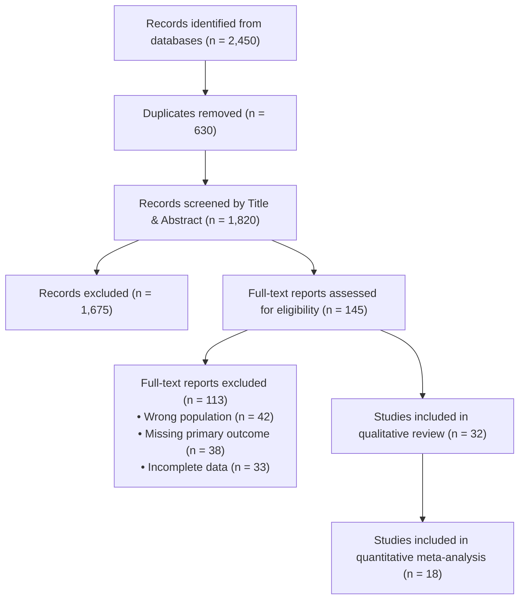

> [!abstract] Structured Abstract (PRISMA 2020)
> **Background:** State the rationale and objectives in 1–2 sentences.
> **Methods:** Databases searched (PubMed, Scopus, Web of Science) up to [Date], search limits, eligibility criteria (PICO/PCC), Risk of Bias assessment tool (e.g., RoB 2, ROBINS-I), and synthesis methods.
> **Results:** Total studies screened ($N = \dots$), total studies included ($N = \dots$), primary qualitative findings, and pooled effect sizes if meta-analyzed ($RR/OR/SMD = \dots, 95\% \text{ CI } [\dots, \dots], I^2 = \dots\%$).
> **Discussion:** Interpretation of evidence certainty (GRADE), limitations of included literature and review process.
> **Registration:** PROSPERO ID: CRD42026XXXXXX.
> *(Word count target: 250–300 words)*

---

# 1. Introduction

## 1.1 Rationale
Describe the burden, clinical/scientific challenge, and why a systematic aggregation of existing evidence is required.

## 1.2 Objectives & PICO / PCC Framework
This review systematically synthesizes evidence to answer the following research question:
- **Population (P):** Explicitly define target group/phenomenon.
- **Intervention (I):** Intervention, algorithmic technique, or exposure.
- **Comparator (C):** Control group, standard care, or alternative baseline.
- **Outcomes (O):** Primary and secondary endpoints.
- **Study Design (S):** Eligible study types (e.g., RCTs, prospective cohorts).

---

# 2. Methods

This review was conducted in accordance with the Preferred Reporting Items for Systematic Reviews and Meta-Analyses (PRISMA 2020) statement. The protocol was registered in PROSPERO (Registration ID: `CRD42026XXXXXX`).

## 2.1 Information Sources & Search Strategy
Literature searches were conducted across PubMed, Scopus, Web of Science Core Collection, and IEEE Xplore from database inception to [Date].

```text
Full Search String Example (PubMed):
("Artificial Intelligence"[Mesh] OR "Machine Learning"[tiab] OR "Deep Learning"[tiab])
AND
("Diagnostic Accuracy"[Mesh] OR "Sensitivity"[tiab] OR "Specificity"[tiab])
AND
("Prognosis"[Mesh] OR "Survival Analysis"[tiab])
```

## 2.2 Eligibility Criteria
- **Inclusion Criteria:**
  1. Peer-reviewed original empirical studies.
  2. Studies reporting on [Specific Population / Task].
  3. Direct quantitative evaluation of [Primary Outcome].
  4. English language publications.
- **Exclusion Criteria:**
  1. Conference abstracts lacking complete methodology, editorials, and narrative reviews.
  2. Inadequate data to calculate effect sizes or diagnostic accuracy metrics.
  3. Animal or in-vitro models (if human review).

## 2.3 Selection Process & Screening
Titles and abstracts were screened independently by two reviewers (Reviewer A and Reviewer B) using Rayyan/Covidence. Full-text articles were independently evaluated against eligibility criteria. Discrepancies were resolved by consensus or adjudication by a third senior reviewer. Inter-rater agreement was quantified using Cohen’s Kappa ($\kappa = 0.86$).

## 2.4 Data Extraction & Management
Extracted data elements: author, year, country, study design, sample size, intervention protocol, control conditions, primary outcomes, and follow-up duration.

## 2.5 Risk of Bias in Individual Studies
Appraised using the Cochrane Risk of Bias 2 (RoB 2) tool for randomized trials / ROBINS-I for non-randomized studies. Domains assessed include bias arising from randomization, deviations from intended interventions, missing outcome data, measurement of outcomes, and selection of reported results.

## 2.6 Synthesis Methods & Statistical Analysis
- **Heterogeneity:** Evaluated via Cochran's $Q$ test and the $I^2$ index.
- **Meta-Analysis:** Pooled using a random-effects model (DerSimonian and Laird / Restricted Maximum Likelihood).
- **Publication Bias:** Assessed via funnel plots and Egger’s linear regression test if $\ge 10$ studies were included.
- **Certainty of Evidence:** Rated using the GRADE approach across risk of bias, inconsistency, indirectness, imprecision, and publication bias.

---

# 3. Results

## 3.1 Study Selection (PRISMA Flow Diagram)
Database searching yielded $N = 2,450$ records. After deduplication, $N = 1,820$ records remained for title and abstract screening. Full texts of $N = 145$ reports were reviewed; $N = 32$ met all inclusion criteria.



## 3.2 Study Characteristics & Qualitative Synthesis
Summary of included studies:

| Study ID | Design | Sample Size ($N$) | Intervention / Model | Comparator | Primary Outcome | Key Finding |
| :--- | :---: | :---: | :--- | :--- | :--- | :--- |
| Smith et al. (2023) | RCT | $250$ | Deep ResNet-50 | Standard Care | AUROC | $0.94$ vs $0.82$ |
| Zhang et al. (2024) | Cohort | $1,120$ | Transformer Model | Logistic Baseline | Specificity | $91.2\%$ vs $84.0\%$ |

## 3.3 Risk of Bias Assessment
Detailed appraisal across domains:
- Low risk of bias: $18$ studies ($56\%$).
- Some concerns: $10$ studies ($31\%$).
- High risk of bias: $4$ studies ($13\%$).

## 3.4 Quantitative Synthesis & Meta-Analysis
Pooled effect estimates across $18$ studies:
- Pooled Risk Ratio: $RR = 1.42, 95\% \text{ CI } [1.24, 1.63], p < .001$.
- Heterogeneity: $\tau^2 = 0.04, \chi^2 = 28.4, df = 17 (p = .04), I^2 = 40.1\%$.
- Subgroup Analysis: Stratified by study design and sample size.

---

# 4. Discussion

## 4.1 Summary of Main Findings
Synthesize the primary evidence.

## 4.2 Strengths & Limitations of Evidence
Discuss internal validity, risk of bias in included literature, and generalizability.

## 4.3 Limitations of the Review Process
Acknowledge potential language biases, search date cutoffs, or unpublished gray literature.

## 4.4 Implications for Practice and Research
Recommendations for clinicians, engineers, or policymakers.

---

# 5. Conclusion
Definitive closing statement summarizing evidence certainty and urgent priorities for future trials.

---

# Declarations

## Protocol Registration
Registered in PROSPERO (CRD42026XXXXXX).

## Data Availability
The extraction sheets, risk of bias scores, and R/Stata meta-analysis scripts are available at `[Repository URL]`.

## References
<!-- References auto-inserted by Pandoc / Zotero -->
