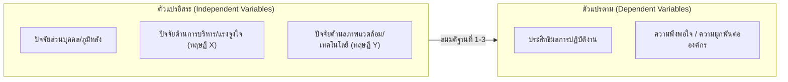

# โครงร่างรายงานการวิจัยฉบับสมบูรณ์ / วิทยานิพนธ์ 5 บท (Thesis / Comprehensive Research Report)
> **มาตรฐาน:** สำนักพิมพ์มหาวิทยาลัยนเรศวร (NU Press) & คู่มือวิทยานิพนธ์ระดับบัณฑิตศึกษา  
> **สถานะโครงงาน:** `[DRAFT / UNDER REVIEW / COMPLETED]`  
> **ชื่อเรื่องภาษาไทย:** `[ระบุชื่อเรื่องภาษาไทยที่กระชับ สื่อความหมายชัดเจน]`  
> **ชื่อเรื่องภาษาอังกฤษ:** `[Specify Concise and Informative English Title]`  
> **ผู้วิจัย:** `[ชื่อ-สกุล ผู้วิจัย]` | **อาจารย์ที่ปรึกษา:** `[ชื่อ-สกุล อาจารย์ที่ปรึกษาหลัก/ร่วม]`  
> **สถาบัน / แหล่งทุน:** `[ระบุสาขาวิชา คณะ มหาวิทยาลัย หรือแหล่งทุนสนับสนุน]` | **ปีที่พิมพ์:** `[พ.ศ. 25XX / ค.ศ. 20XX]`

---

# ส่วนหน้า (Front Matter)

## ปกนอก และ ปกรอง (Title Page)
*(จัดรูปแบบตามระเบียบของบัณฑิตวิทยาลัยหรือแหล่งทุน)*

## บทคัดย่อภาษาไทย
**ชื่อเรื่อง:** `[ระบุชื่อเรื่องภาษาไทย]`  
**ผู้วิจัย:** `[ชื่อ-สกุล]` | **อาจารย์ที่ปรึกษา:** `[ชื่อ-สกุล]`  
**สาขาวิชา:** `[สาขาวิชา]` | **ปีการศึกษา:** `[พ.ศ. 25XX]`  

`[ย่อหน้าเนื้อหาบทคัดย่อภาษาไทย ความยาวประมาณ 300–450 คำ (1–1.5 หน้า) ประกอบด้วย:]`
1. **วัตถุประสงค์ของการวิจัย:** การวิจัยครั้งนี้มีวัตถุประสงค์เพื่อ (1)... (2)...
2. **วิธีดำเนินการวิจัยโดยย่อ:** ประชากรและกลุ่มตัวอย่างคือ... เครื่องมือที่ใช้ในการวิจัยประกอบด้วย... ผ่านการตรวจสอบความตรงเชิงเนื้อหาได้ค่า IOC เท่ากับ... และความเชื่อมั่น Cronbach's Alpha เท่ากับ... สถิติที่ใช้ในการวิเคราะห์ข้อมูลได้แก่...
3. **ผลการวิจัยสำคัญ:** ผลการวิจัยพบว่า (1)... (2)...
4. **คำสำคัญ (Keywords):** `[คำสำคัญ 1]`, `[คำสำคัญ 2]`, `[คำสำคัญ 3]`, `[คำสำคัญ 4]` *(3–5 คำ)*

---

## บทคัดย่อภาษาอังกฤษ (Abstract)
**Title:** `[English Title]`  
**Author:** `[Author Name]` | **Advisor:** `[Advisor Name]`  
**Major:** `[Major/Field]` | **Academic Year:** `[Academic Year]`  

`[English abstract text matching the Thai version precisely: Research objectives, Target population, Sampling method, Instruments & Validation metrics (IOC, Alpha), Core empirical findings, and Key statistical indicators.]`

**Keywords:** `[Keyword 1]`, `[Keyword 2]`, `[Keyword 3]`, `[Keyword 4]` *(3–5 words)*

---

## กิตติกรรมประกาศ (Acknowledgements)
`[ข้อความแสดงความขอบคุณต่ออาจารย์ที่ปรึกษา ผู้เชี่ยวชาญตรวจสอบเครื่องมือ ผู้ตอบแบบสอบถาม/กลุ่มตัวอย่าง แหล่งทุนสนับสนุนการวิจัย และบุคคลที่มีส่วนช่วยเหลือให้งานวิจัยสำเร็จลุล่วง]`

---

## สารบัญ (Table of Contents)
- **บทคัดย่อภาษาไทย** ............................................................................ ก
- **บทคัดย่อภาษาอังกฤษ** ......................................................................... ข
- **กิตติกรรมประกาศ** .............................................................................. ค
- **สารบัญ** ........................................................................................... ง
- **สารบัญตาราง** ................................................................................... จ
- **สารบัญภาพ** ..................................................................................... ฉ
- **บทที่ 1 บทนำ** ................................................................................... 1
- **บทที่ 2 แนวคิด ทฤษฎี และงานวิจัยที่เกี่ยวข้อง** ............................................ XX
- **บทที่ 3 วิธีดำเนินการวิจัย** .................................................................... XX
- **บทที่ 4 ผลการวิเคราะห์ข้อมูล** ............................................................... XX
- **บทที่ 5 สรุปผล อภิปรายผล และข้อเสนอแนะ** ............................................. XX
- **บรรณานุกรม** .................................................................................... XX
- **ภาคผนวก** ....................................................................................... XX
- **ประวัติผู้วิจัย** .................................................................................... XX

## สารบัญตาราง (List of Tables)
*(ระบุหมายเลขตาราง ชื่อตาราง และเลขหน้า)*

## สารบัญภาพ (List of Figures)
*(ระบุหมายเลขภาพ ชื่อแผนภาพ/แผนภูมิ และเลขหน้า)*

---

# บทที่ 1 บทนำ

## 1.1 ความเป็นมาและความสำคัญของปัญหา
`[ยกร่างแบบ Funnel Approach จากภาพกว้างระดับมหภาคสู่ประเด็นปัญหาเฉพาะพื้นที่ 10–15 หน้า]`
- **บริบทระดับมหภาค (Macro Level):** สภาพการณ์ แนวโน้มระดับสากลหรือระดับชาติ นโยบาย กฎหมาย หรือยุทธศาสตร์ที่เกี่ยวข้อง
- **บริบทระดับจุลภาคและปัญหาเชิงประจักษ์ (Micro Level):** สภาพปัญหาในหน่วยงาน ชุมชน หรือพื้นที่ศึกษา ข้อมูลสถิติความเสียหายหรือช่องว่างที่เกิดขึ้นจริง
- **ช่องว่างทางวิชาการ (Research Gap):** สิ่งที่งานวิจัยก่อนหน้ายังไม่ได้ตอบ หรือข้อจำกัดในอดีตที่จำเป็นต้องพัฒนาต่อยอด
- **เหตุผลความจำเป็นและประโยชน์ของการศึกษาครั้งนี้:** ทำไมจึงต้องทำการวิจัยนี้ ณ เวลานี้ และจะเกิดผลกระทบเชิงบวกอย่างไร

## 1.2 วัตถุประสงค์ของการวิจัย
การวิจัยครั้งนี้มีวัตถุประสงค์เฉพาะ ดังนี้:
1. เพื่อศึกษา/สำรวจ `[ตัวแปรที่ 1 / สภาพปัจจุบัน]` ของ `[กลุ่มเป้าหมาย]`
2. เพื่อเปรียบเทียบ `[ความแตกต่างระหว่างกลุ่มตามปัจจัยภูมิหลัง]`
3. เพื่อศึกษาความสัมพันธ์ / วิเคราะห์อิทธิพลของ `[ตัวแปรต้น]` ที่ส่งผลต่อ `[ตัวแปรตาม]`
4. เพื่อพัฒนา / เสนอแนะแนวทาง `[รูปแบบ/นวัตกรรม/ข้อเสนอเชิงนโยบาย]`

## 1.3 กรอบแนวคิดในการวิจัย (Conceptual Framework)
`[ใส่แผนภาพกรอบแนวคิดแสดงความสัมพันธ์ของตัวแปรที่สังเคราะห์มาจากทฤษฎีในบทที่ 2]`

## 1.4 สมมติฐานของการวิจัย (Hypotheses)
*(ระบุในกรณีที่เป็นการวิจัยเชิงปริมาณที่มุ่งทดสอบความสัมพันธ์หรือเปรียบเทียบความแตกต่าง)*
1. กลุ่มตัวอย่างที่มีปัจจัยส่วนบุคคลต่างกัน มีระดับ `[ตัวแปรตาม]` แตกต่างกันอย่างมีนัยสำคัญทางสถิติ
2. `[ตัวแปรต้น X1]` มีความสัมพันธ์เชิงบวกกับ `[ตัวแปรตาม Y]` อย่างมีนัยสำคัญทางสถิติ
3. `[ตัวแปรต้น X1, X2, X3]` ร่วมกันพยากรณ์ `[ตัวแปรตาม Y]` ได้อย่างมีนัยสำคัญทางสถิติ

## 1.5 ขอบเขตของการวิจัย (Scope of the Study)
- **1.5.1 ขอบเขตด้านประชากรและกลุ่มตัวอย่าง:**
  - ประชากรคือ `[ระบุกลุ่มประชากรและจำนวนรวม N]`
  - กลุ่มตัวอย่างคือ `[ระบุจำนวนกลุ่มตัวอย่าง n และวิธีการได้มา]`
- **1.5.2 ขอบเขตด้านเนื้อหา / ตัวแปร:**
  - ตัวแปรอิสระ (Independent Variables) ได้แก่...
  - ตัวแปรตาม (Dependent Variables) ได้แก่...
- **1.5.3 ขอบเขตด้านพื้นที่:** `[ระบุหน่วยงาน โรงเรียน โรงพยาบาล หรือจังหวัดที่ทำการศึกษา]`
- **1.5.4 ขอบเขตด้านระยะเวลา:** ดำเนินการวิจัยระหว่างเดือน `[เดือน ปี]` ถึงเดือน `[เดือน ปี]`

## 1.6 ประโยชน์ที่คาดว่าจะได้รับ
1. **ประโยชน์เชิงนโยบาย (Policy Implication):** หน่วยงานต้นสังกัดสามารถนำผลการวิจัยไปใช้กำหนดแผนยุทธศาสตร์...
2. **ประโยชน์เชิงปฏิบัติการ (Practical Implication):** ผู้บริหารและผู้ปฏิบัติงานสามารถนำข้อค้นพบไปประยุกต์ใช้ในการปรับปรุง...
3. **ประโยชน์เชิงวิชาการ (Academic Contribution):** ได้องค์ความรู้ใหม่และแบบจำลองเชิงโครงสร้างที่สามารถใช้อ้างอิงทางวิชาการ...

## 1.7 นิยามศัพท์เฉพาะ (Operational Definitions)
*(นิยามเชิงปฏิบัติการที่วัดได้ ระบุตัวชี้วัดและเครื่องมือ)*
- **[ชื่อตัวแปรที่ 1]:** หมายถึง `[คำนิยามเชิงปฏิบัติการ]` ซึ่งวัดได้จาก `[ระบุเครื่องมือและข้อคำถาม]` โดยใช้เกณฑ์ `[ระบุเกณฑ์การประเมิน]`
- **[ชื่อตัวแปรที่ 2]:** หมายถึง...

---

# บทที่ 2 แนวคิด ทฤษฎี และงานวิจัยที่เกี่ยวข้อง

`[สังเคราะห์และจัดหมวดหมู่เอกสารวิชาการ 30–70 หน้า ไม่คัดลอกมาวางเป็นท่อนๆ]`

## 2.1 แนวคิดและทฤษฎีเกี่ยวกับ [ตัวแปรต้น / ประเด็นหลักที่ 1]
- 2.1.1 ความหมายและนิยามของ `[ตัวแปร]`
- 2.1.2 องค์ประกอบและมิติย่อย
- 2.1.3 ทฤษฎีที่ใช้รองรับ (Theoretical Foundation)
- 2.1.4 เครื่องมือและการวัดค่า

## 2.2 แนวคิดและทฤษฎีเกี่ยวกับ [ตัวแปรตาม / ผลลัพธ์]
- 2.2.1 ความหมายและทฤษฎีที่เกี่ยวข้อง
- 2.2.2 ปัจจัยที่ส่งผลต่อ `[ตัวแปรตาม]`
- 2.2.3 เกณฑ์และตัวชี้วัดความสำเร็จ

## 2.3 บริบททั่วไปของพื้นที่ศึกษา / องค์กรเป้าหมาย (ถ้ามี)
`[ข้อมูลสภาพแวดล้อม ประวัติ ภารกิจ โครงสร้างองค์กรที่เกี่ยวข้องกับการวิจัย]`

## 2.4 งานวิจัยที่เกี่ยวข้อง
### 2.4.1 งานวิจัยในประเทศ
`[สังเคราะห์งานวิจัยในประเทศ จัดกลุ่มตามประเด็นตัวแปรและข้อค้นพบ ชี้ให้เห็นแบบแผน (Patterns) ที่สอดคล้องหรือขัดแย้ง]`

### 2.4.2 งานวิจัยต่างประเทศ
`[สังเคราะห์งานวิจัยในระดับสากล นวัตกรรมระเบียบวิธีวิจัย และทฤษฎีร่วมสมัย]`

## 2.5 ตารางสังเคราะห์วรรณกรรม (Literature Synthesis Matrix)

| ผู้วิจัย และปี (พ.ศ. / ค.ศ.) | ตัวแปรต้นที่ศึกษา | ตัวแปรตามที่ศึกษา | กลุ่มตัวอย่าง | เครื่องมือ & สถิติ | ข้อค้นพบสำคัญ |
| :--- | :--- | :--- | :--- | :--- | :--- |
| สมชาย และคณะ (2565) | ภาวะผู้นำ, บรรยากาศ | ประสิทธิผล | บุคลากร 320 คน | แบบสอบถาม, Regression | ภาวะผู้นำมีอิทธิพลเชิงบวก ($\beta = 0.45, p < .01$) |
| Smith & Taylor (2023) | Digital Readiness | Innovation | ครู 450 คน | SEM | ความพร้อมทางดิจิทัลส่งผลต่อการสร้างนวัตกรรม |

---

# บทที่ 3 วิธีดำเนินการวิจัย

## 3.1 ประชากรและกลุ่มตัวอย่าง
- **ประชากร (Population):** ประชากรที่ใช้ในการวิจัยครั้งนี้ คือ `[ระบุกลุ่มประชากร]` จำนวนทั้งสิ้น $N = `[ระบุตัวเลข]`$ คน
- **การกำหนดขนาดกลุ่มตัวอย่าง (Sample Size Determination):**
  - กำหนดขนาดโดยใช้สูตรของ `[Taro Yamane (1973) / Krejcie & Morgan (1970) / G*Power 3.1]` ที่ระดับความเชื่อมั่น 95% ความคลาดเคลื่อนที่ยอมรับได้ $e = 0.05$
  - ขนาดตัวอย่างคำนวณได้ $n = `[ระบุตัวเลข]`$ คน และเพิ่มสัดส่วนสำรองการสูญหาย (Dropout Rate 10%) รวมเป็นกลุ่มตัวอย่างจริงทั้งสิ้น $n = `[ระบุตัวเลขรวม]`$ คน
- **วิธีการสุ่มตัวอย่าง (Sampling Technique):**
  - ใช้การสุ่มตัวอย่างแบบหลายขั้นตอน (Multi-stage Stratified Random Sampling) ดังนี้:
    - *ขั้นที่ 1:* แบ่งกลุ่มตามชั้นภูมิ (Stratified by Department/Region)
    - *ขั้นที่ 2:* คำนวณสัดส่วนกลุ่มตัวอย่างในแต่ละชั้นภูมิ (Proportional Allocation)
    - *ขั้นที่ 3:* สุ่มตัวอย่างอย่างง่าย (Simple Random Sampling) ด้วยการจับสลากหรือตารางเลขสุ่ม

## 3.2 เครื่องมือที่ใช้ในการวิจัย
- **ลักษณะเครื่องมือ:** แบบสอบถาม (Questionnaire) แบ่งออกเป็น `[X]` ตอน:
  - *ตอนที่ 1:* ข้อมูลทั่วไปของผู้ตอบแบบสอบถาม (Checklist)
  - *ตอนที่ 2:* ข้อคำถามเกี่ยวกับ `[ตัวแปรต้น]` มาตรประมาณค่า 5 ระดับ (Likert Scale) จำนวน `[X]` ข้อ
  - *ตอนที่ 3:* ข้อคำถามเกี่ยวกับ `[ตัวแปรตาม]` มาตรประมาณค่า 5 ระดับ จำนวน `[X]` ข้อ
  - *ตอนที่ 4:* ข้อเสนอแนะปลายเปิด (Open-ended)
- **ขั้นตอนการสร้างและการตรวจสอบคุณภาพเครื่องมือ:**
  1. ศึกษานิยาม ทฤษฎี และกำหนดโครงสร้างข้อคำถาม (Table of Specifications)
  2. ยกร่างข้อคำถามและเสนออาจารย์ที่ปรึกษาเพื่อตรวจสอบความสอดคล้อง
  3. **การตรวจสอบความตรงเชิงเนื้อหา (Content Validity):**
     - เสนอผู้เชี่ยวชาญจำนวน 5 ท่าน ตรวจสอบค่าดัชนีความสอดคล้อง (Index of Item-Objective Congruence: IOC)
     - คัดเลือกข้อคำถามที่มีค่า $\text{IOC} \ge 0.50$ (ผลการประเมินอยู่ระหว่าง $0.60 - 1.00$ ทุกข้อ รายละเอียดในภาคผนวก ค)
  4. **การทดลองใช้เครื่องมือ (Try-out):**
     - นำแบบสอบถามที่ปรับปรุงแล้วไปทดลองใช้กับกลุ่มที่มีลักษณะคล้ายคลึงกับกลุ่มตัวอย่าง จำนวน 30 คน
  5. **การหาค่าอำนาจจำแนกและความเชื่อมั่น (Reliability):**
     - วิเคราะห์ค่าอำนาจจำแนกรายข้อ (Corrected Item-Total Correlation: $r_{xy} \ge 0.30$)
     - คำนวณค่าสัมประสิทธิ์แอลฟาของครอนบาค (Cronbach's Alpha Coefficient) ได้ค่าความเชื่อมั่นของเครื่องมือทั้งฉบับเท่ากับ $\alpha = `[ระบุ เช่น 0.92]`$ (รายละเอียดในภาคผนวก ง)

## 3.3 วิธีการเก็บรวบรวมข้อมูล
- ทำหนังสือขอความอนุเคราะห์จากบัณฑิตวิทยาลัย/คณะ ถึงหัวหน้าหน่วยงานเป้าหมาย
- ดำเนินการตามมาตรฐานจริยธรรมการวิจัยในมนุษย์ (IRB Certificate No. `[ระบุเลขที่รับรอง]`)
- แจกแบบสอบถามทั้งรูปแบบเอกสารและ Google Forms ระหว่างวันที่ `[ว/ด/ป]` ถึง `[ว/ด/ป]`
- ติดตามแบบสอบถาม ได้รับแบบสอบถามกลับคืนมาจำนวน `[n]` ชุด คิดเป็นอัตราตอบกลับ `[X.XX]%`

## 3.4 การวิเคราะห์ข้อมูลและสถิติที่ใช้
- **การให้คะแนนและเกณฑ์การแปลผล:**
  คำนวณความกว้างของอันตรภาคชั้น $= \frac{\text{คะแนนสูงสุด} - \text{คะแนนต่ำสุด}}{\text{จำนวนชั้น}} = \frac{5 - 1}{5} = 0.80$
  - ค่าเฉลี่ย $4.51 - 5.00$ แปลผลว่า มีระดับการปฏิบัติ/ความคิดเห็นอยู่ในระดับ **มากที่สุด**
  - ค่าเฉลี่ย $3.51 - 4.50$ แปลผลว่า อยู่ในระดับ **มาก**
  - ค่าเฉลี่ย $2.51 - 3.50$ แปลผลว่า อยู่ในระดับ **ปานกลาง**
  - ค่าเฉลี่ย $1.51 - 2.50$ แปลผลว่า อยู่ในระดับ **น้อย**
  - ค่าเฉลี่ย $1.00 - 1.50$ แปลผลว่า อยู่ในระดับ **น้อยที่สุด**
- **สถิติที่ใช้ในการวิเคราะห์:**
  - สถิติพรรณนา: ค่าความถี่ (Frequency), ร้อยละ (Percentage), ค่าเฉลี่ย ($\bar{X}$), ส่วนเบี่ยงเบนมาตรฐาน ($S.D.$)
  - สถิติอ้างอิง: Independent t-test, One-Way ANOVA (ทดสอบความแปรปรวน Scheffé/LSD), Pearson Product Moment Correlation, และ Multiple Linear Regression Analysis

---

# บทที่ 4 ผลการวิเคราะห์ข้อมูล

## 4.1 สัญลักษณ์และอักษรย่อที่ใช้ในการวิเคราะห์ข้อมูล
- $N$ แทน จำนวนประชากรทั้งหมด
- $n$ แทน จำนวนกลุ่มตัวอย่าง
- $\bar{X}$ แทน ค่าเฉลี่ย (Mean)
- $S.D.$ แทน ส่วนเบี่ยงเบนมาตรฐาน (Standard Deviation)
- $t$ แทน ค่าสถิติทดสอบ t-distribution
- $F$ แทน ค่าสถิติทดสอบ One-Way ANOVA
- $r$ แทน ค่าสัมประสิทธิ์สหสัมพันธ์เพียร์สัน
- $p$ แทน ค่าความน่าจะเป็นของนัยสำคัญทางสถิติ (p-value)

## 4.2 ผลการวิเคราะห์ข้อมูล
*(นำเสนอตามลำดับวัตถุประสงค์การวิจัย)*

### ตอนที่ 1: ผลการวิเคราะห์ข้อมูลทั่วไปของกลุ่มตัวอย่าง
**ตารางที่ 4.1** จำนวนและร้อยละของกลุ่มตัวอย่างจำแนกตามข้อมูลส่วนบุคคล ($n = 350$)

| ข้อมูลทั่วไป | จำนวน (คน) | ร้อยละ (%) |
| :--- | :---: | :---: |
| **เพศ** | | |
| ชาย | 140 | 40.00 |
| หญิง | 210 | 60.00 |
| **อายุ** | | |
| ต่ำกว่า 30 ปี | 85 | 24.29 |
| 30 – 45 ปี | 195 | 55.71 |
| 46 ปีขึ้นไป | 70 | 20.00 |
| **รวม** | **350** | **100.00** |

*จากตารางที่ 4.1 พบว่า กลุ่มตัวอย่างส่วนใหญ่เป็นเพศหญิง จำนวน 210 คน คิดเป็นร้อยละ 60.00 มีช่วงอายุระหว่าง 30 – 45 ปี มากที่สุด จำนวน 195 คน คิดเป็นร้อยละ 55.71...*

### ตอนที่ 2: ผลการวิเคราะห์ระดับ [ตัวแปรที่ 1]
**ตารางที่ 4.2** ค่าเฉลี่ย ส่วนเบี่ยงเบนมาตรฐาน และระดับความคิดเห็นต่อ `[ตัวแปรที่ 1]` รายด้านและภาพรวม ($n = 350$)

| ด้านของตัวแปร | $\bar{X}$ | $S.D.$ | ระดับความคิดเห็น | ลำดับที่ |
| :--- | :---: | :---: | :---: | :---: |
| 1. ด้านภาวะผู้นำทางวิชาการ | 4.25 | 0.52 | มาก | 2 |
| 2. ด้านการสนับสนุนทรัพยากร | 3.88 | 0.61 | มาก | 3 |
| 3. ด้านการทำงานเป็นทีม | 4.41 | 0.48 | มาก | 1 |
| **รวมทุกด้าน** | **4.18** | **0.45** | **มาก** | |

*จากตารางที่ 4.2 พบว่า ระดับความคิดเห็นต่อ `[ตัวแปรที่ 1]` ในภาพรวมอยู่ในระดับมาก ($\bar{X} = 4.18, S.D. = 0.45$) เมื่อพิจารณารายด้านพบว่า ด้านที่มีค่าเฉลี่ยสูงสุดคือ ด้านการทำงานเป็นทีม ($\bar{X} = 4.41, S.D. = 0.48$) รองลงมาคือ ด้านภาวะผู้นำทางวิชาการ ($\bar{X} = 4.25, S.D. = 0.52$) ส่วนด้านที่มีค่าเฉลี่ยต่ำที่สุดคือ ด้านการสนับสนุนทรัพยากร ($\bar{X} = 3.88, S.D. = 0.61$)...*

### ตอนที่ 3: ผลการวิเคราะห์ระดับ [ตัวแปรที่ 2] (จำแนกรายข้อและรายด้าน)
*(แสดงตารางแจกแจงค่าสถิติรายข้ออย่างละเอียด)*

### ตอนที่ 4: ผลการทดสอบสมมติฐานการวิจัย
**ตารางที่ 4.3** ผลการวิเคราะห์การถดถอยพหุคูณปัจจัยที่ส่งผลต่อ `[ตัวแปรตาม]`

| ตัวแปรต้น | $B$ | $SE_B$ | $\beta$ | $t$ | $p$-value |
| :--- | :---: | :---: | :---: | :---: | :---: |
| (ค่าคงที่ Constant) | 0.852 | 0.215 | - | 3.963 | < .001 |
| ด้านภาวะผู้นำ ($X_1$) | 0.384 | 0.052 | .395 | 7.385 | < .001 |
| ด้านบรรยากาศองค์กร ($X_2$) | 0.291 | 0.048 | .312 | 6.062 | < .001 |

$R = .682, \quad R^2 = .465, \quad \text{Adjusted } R^2 = .462, \quad F = 150.84, \quad p < .001$

---

# บทที่ 5 สรุปผล อภิปรายผล และข้อเสนอแนะ

## 5.1 สรุปผลการวิจัย
`[สรุปสาระสำคัญของข้อค้นพบตามวัตถุประสงค์การวิจัยทีละข้อโดยย่อและกระชับ]`
1. ข้อมูลทั่วไปของกลุ่มตัวอย่าง: ...
2. ระดับ `[ตัวแปรที่ 1]` ในภาพรวมอยู่ในระดับมาก...
3. ผลการทดสอบสมมติฐานพบว่า `[ตัวแปรต้น]` ร่วมกันทำนาย `[ตัวแปรตาม]` ได้ร้อยละ 46.50 อย่างมีนัยสำคัญทางสถิติที่ระดับ .01...

## 5.2 การอภิปรายผล (In-depth Dialectical Discussion)
`[อภิปรายผลทีละประเด็น อธิบายเหตุผลเบื้องหลัง และดึงทฤษฎี/งานวิจัยจากบทที่ 2 มาเปรียบเทียบ]`
- **ประเด็นที่ 1:** จากผลการวิจัยพบว่า `[ระบุข้อค้นพบ]` ทั้งนี้เนื่องจาก `[อธิบายเหตุผลทางทฤษฎีและบริบทหน้างาน]` ซึ่งผลการวิจัยนี้ **สอดคล้องกับแนวคิดของ** `[ชื่อนักวิชาการ/ทฤษฎีในบทที่ 2]` ที่ระบุว่า... อีกทั้งยัง **สอดคล้องกับงานวิจัยของ** `[อ้างอิงงานวิจัยในประเทศ/ต่างประเทศ]` ซึ่งพบว่า...
- **ประเด็นที่ 2:** ผลการวิเคราะห์พบว่าด้านที่ได้คะแนนต่ำที่สุดคือ `[ระบุ]` ซึ่งสะท้อนให้เห็นว่า `[วิเคราะห์สาเหตุ]` ข้อค้นพบนี้ **สอดคล้องกับ/แตกต่างจาก** งานวิจัยของ `[อ้างอิง]` เนื่องจากความแตกต่างด้านบริบท...

## 5.3 ข้อเสนอแนะ
### 5.3.1 ข้อเสนอแนะในการนำผลการวิจัยไปใช้
1. **ข้อเสนอแนะเชิงนโยบาย (Policy Recommendations):** ผู้บริหารหน่วยงานควรจัดทำแผนงานสนับสนุน...
2. **ข้อเสนอแนะเชิงปฏิบัติการ (Practical Recommendations):** ผู้ปฏิบัติงานควรนำรูปแบบการทำงานเป็นทีมมาปรับใช้ในกระบวนการ...

### 5.3.2 ข้อเสนอแนะในการทำวิจัยครั้งต่อไป
1. ควรทำการศึกษาวิจัยเชิงคุณภาพ (Qualitative Research) เพิ่มเติม โดยการสัมภาษณ์เชิงลึกเพื่อเจาะลึกปัจจัยเชิงบริบท...
2. ควรขยายขอบเขตการวิจัยไปยังกลุ่มประชากรในภูมิภาคอื่นๆ เพื่อเปรียบเทียบความแตกต่างเชิงพื้นที่...

---

# ส่วนท้าย (Back Matter)

## บรรณานุกรม (References - APA 7th Edition)

### ภาษาไทย (เรียงตามลำดับตัวอักษร ก–ฮ)
- กรมควบคุมโรค. (2565). *รายงานสถานการณ์โรคและภัยสุขภาพประจำปี*. กระทรวงสาธารณสุข.
- บุญชม ศรีสะอาด. (2560). *การวิจัยเบื้องต้น* (พิมพ์ครั้งที่ 10). สุวีริยาสาส์น.
- สมคิด วิริยะ. (2564). ปัจจัยที่มีอิทธิพลต่อประสิทธิผลการปฏิบัติงาน. *วารสารวิชาการ มหาวิทยาลัยนเรศวร*, 28(2), 115–128. https://doi.org/10.14456/nu.2021.45

### ภาษาอังกฤษ (เรียงตามลำดับตัวอักษร A–Z)
- Cohen, J. (1988). *Statistical power analysis for the behavioral sciences* (2nd ed.). Lawrence Erlbaum Associates.
- Hair, J. F., Black, W. C., Babin, B. J., & Anderson, R. E. (2019). *Multivariate data analysis* (8th ed.). Cengage Learning.
- Kline, R. B. (2023). *Principles and practice of structural equation modeling* (5th ed.). Guilford Press.

---

## ภาคผนวก (Appendices)

### ภาคผนวก ก: รายนามและประวัติย่อของผู้เชี่ยวชาญตรวจสอบคุณภาพเครื่องมือวิจัย
1. `[ชื่อ-สกุล, ตำแหน่งวิชาการ, สังกัด/หน่วยงาน, วุฒิการศึกษา]`
2. `[ชื่อ-สกุล, ตำแหน่งวิชาการ, สังกัด/หน่วยงาน, วุฒิการศึกษา]`
3. `[ชื่อ-สกุล, ตำแหน่งวิชาการ, สังกัด/หน่วยงาน, วุฒิการศึกษา]`

### ภาคผนวก ข: เครื่องมือที่ใช้ในการวิจัย (แบบสอบถาม / แบบสัมภาษณ์ฉบับสมบูรณ์)
`[ใส่แบบสอบถามฉบับจริงที่มีคำชี้แจง และข้อคำถามทุกตอน]`

### ภาคผนวก ค: ผลการประเมินความตรงเชิงเนื้อหา (ค่าดัชนี IOC รายข้อของผู้เชี่ยวชาญ)
`[ตารางแสดงคะแนนของผู้เชี่ยวชาญคนที่ 1–5 รายข้อ ผลรวม และค่าเฉลี่ย IOC พร้อมระบุข้อที่ปรับปรุง]`

### ภาคผนวก ง: ผลการวิเคราะห์ค่าอำนาจจำแนกและความเชื่อมั่น (Try-out Reliability Analysis Output)
`[ใส่ผลรันสถิติค่า Item-Total Correlation และ Cronbach's Alpha ของกลุ่มทดลองใช้ 30 คน]`

### ภาคผนวก จ: ผลลัพธ์การวิเคราะห์ข้อมูลทางสถิติฉบับเต็มจากโปรแกรมคอมพิวเตอร์
`[ตาราง ANOVA ฉบับเต็ม, Correlation Matrix, ผลการทดสอบ Normality & Multicollinearity Test (VIF)]`

---

## ประวัติผู้วิจัย (Researcher's Curriculum Vitae)
- **ชื่อ-นามสกุล:** `[ชื่อ-สกุล ผู้วิจัย]`
- **วัน เดือน ปีเกิด:** `[ว/ด/ป]`
- **ประวัติการศึกษา:**
  - พ.ศ. 25XX: `[ปริญญาตรี สาขาวิชา สถาบัน]`
  - พ.ศ. 25XX: `[ปริญญาโท สาขาวิชา สถาบัน]`
- **ตำแหน่งหน้าที่การงานและสถานที่ทำงานปัจจุบัน:** `[ตำแหน่ง และชื่อหน่วยงาน]`
- **ผลงานทางวิชาการ / รางวัลที่ได้รับ:** `[ระบุรายชื่อบทความที่เคยตีพิมพ์ หรือรางวัล]`
